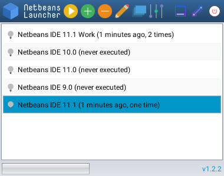

# netbeans-launcher

Simple Netbeans Launcher tool that simplifies launching multiple netbeans instances.
 



## Current version
1.3.3

## Installation
to run netbeans launcher you should have a valid **nuts** installation (>=0.5.7)  and a valid java 8 or later installation.
see [nuts wiki](https://github.com/thevpc/nuts/wiki)

then just type to install it:

```
nuts install netbeans-launcher
```

## Launching the application
To launch the tool  type :
```
nuts netbeans-launcher
```

## Creating an alias to netbeans-launcher
You may use nuts alias mechanism to simplify netbeans launching
```
nuts settings add alias nb netbeans-launcher
```

then you may start

```
nuts nb
```

## Updating netbeans-launcher

```
nuts update netbeans-launcher
```